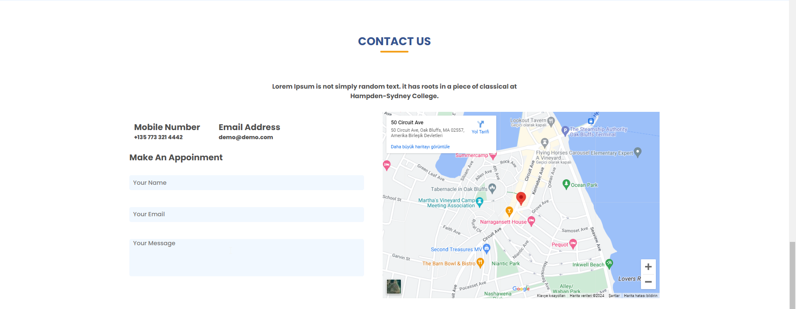
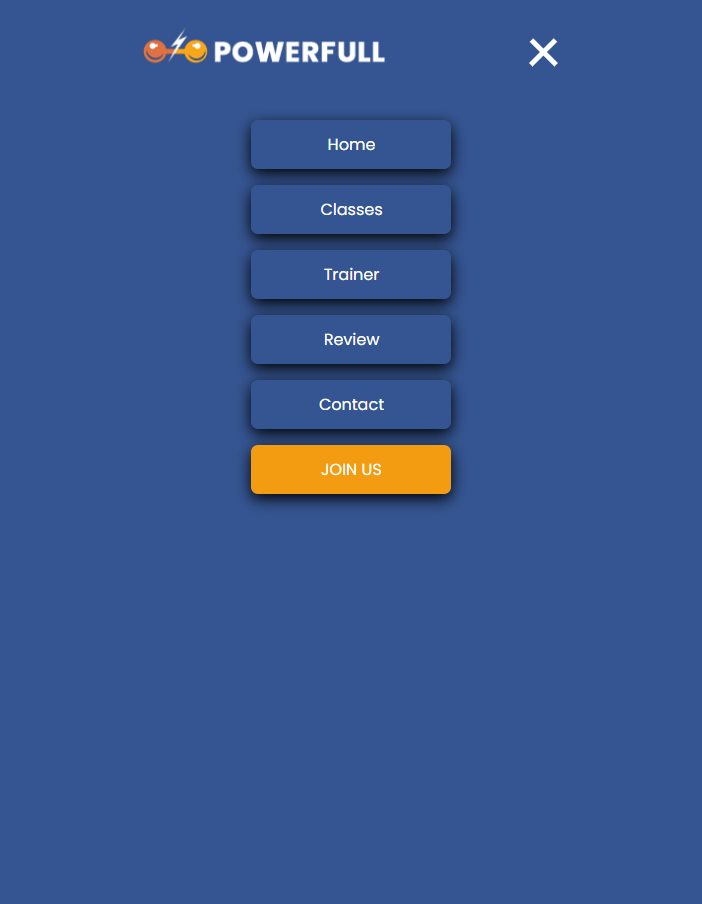

# Fully Responsive Fitness Center Landing Page

## Readme in Other Languages :books:

- :tr: [Türkçe](README_TR.md)
- :uk: [English](README.md)

## Technology Stack

    

## Introduction

Welcome to our fully responsive Fitness Center Landing Page! This landing page is designed to showcase the features and offerings of our fitness center. Whether you're a fitness enthusiast or just starting your fitness journey, our center has something for everyone.

### Project Overview

1. The project is built using pure CSS, without any CSS frameworks or libraries. This ensures that the styling is completely customized and tailored to the specific needs of the fitness center landing page.
 
2. The landing page is fully responsive, meaning it adapts and adjusts its layout and design to different screen sizes and devices. Whether it's viewed on a desktop, laptop, tablet, or mobile phone, the landing page will provide an optimal user experience.
 
3. The landing page is also compatible with different web browsers, ensuring that it functions and displays correctly across popular browsers such as Chrome, Firefox, Safari, and Edge.
 
4. The responsive design and compatibility are achieved through the use of CSS media queries, which allow different styles and layouts to be applied based on the screen size and device.
 
    - **Media Queries**

    The following media queries are used in the Fitness Center Landing Page to ensure responsiveness and compatibility across different screen sizes:

    - `@media all and (min-width: 1440px)`: This media query targets screens with a minimum width of 1440 pixels.

    - `@media all and (min-width: 1044px) and (max-width: 1440px)`: This media query targets screens with a minimum width of 1044 pixels and a maximum width of 1440 pixels.

    - `@media all and (min-width: 768px) and (max-width: 1044px)`: This media query targets screens with a minimum width of 768 pixels and a maximum width of 1044 pixels.

    - `@media all and (min-width: 480px) and (max-width: 768px)`: This media query targets screens with a minimum width of 480 pixels and a maximum width of 768 pixels.

    - `@media all and (min-width: 360px) and (max-width: 480px)`: This media query targets screens with a minimum width of 360 pixels and a maximum width of 480 pixels.

    - `@media all and (max-width: 360px)`: This media query targets screens with a maximum width of 360 pixels.

    These media queries allow the landing page to adjust its layout, styling, and content based on the screen size, providing an optimal user experience across different devices and browsers.
 
5. The layout and content of the landing page are carefully designed to provide a seamless and intuitive user experience. The navigation menu, sections, and call-to-action buttons are strategically placed to guide users and encourage them to explore the fitness center's offerings.
 
6. The use of CSS animations and transitions adds a touch of interactivity and enhances the visual appeal of the landing page. This helps to engage users and create a dynamic and engaging experience.
 
7. The landing page is optimized for performance, with optimized CSS code and image compression techniques. This ensures fast loading times and a smooth browsing experience for users.
 
8. The code is well-structured and organized, following best practices for maintainability and scalability. This allows for easy customization and future updates to the landing page.

Overall, the fully responsive and compatible nature of the fitness center landing page ensures that it can reach and engage a wide range of users, regardless of their device or browser choice.

## Live Preview

 https://bpolat0.github.io/Full-Responsive_Sport-Center-Landing-Page/

## Project Screenshots

*Home Section*

*Classes Section*

*Trainer Section*

*Review Section*

*Contact Section*

*Footer Section*

*Hamburger Menu*

## License

Bu proje MIT lisansı ile lisanslanmıştır. Daha fazla bilgi için [LICENSE](LICENSE) dosyasına bakın.

## Contact

  <a href="https://github.com/Bpolat0">
    

  <a href="https://discord.com/users/m.batuhanpolat">
    

  
  

