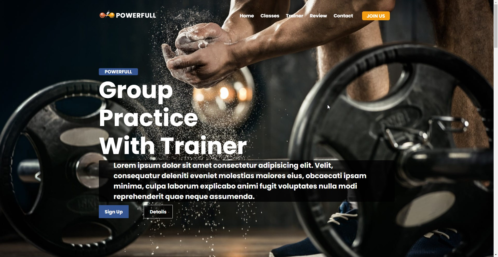
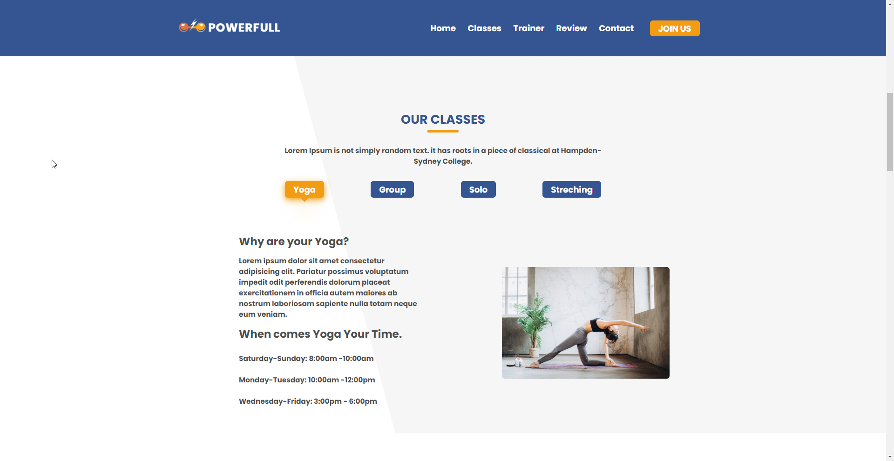
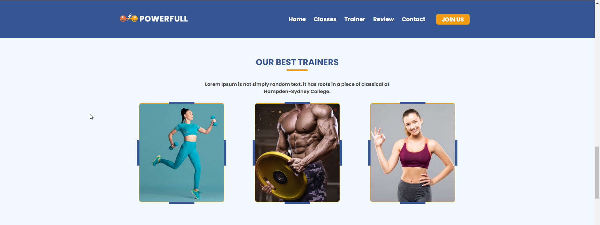
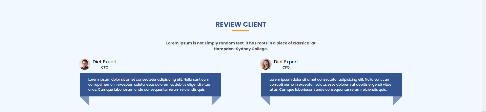
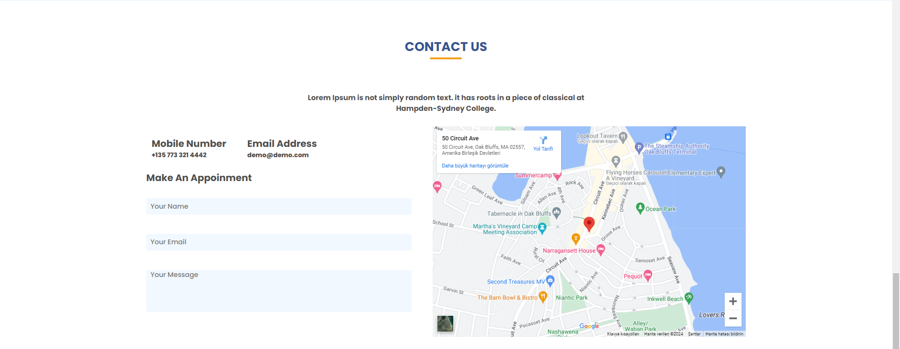
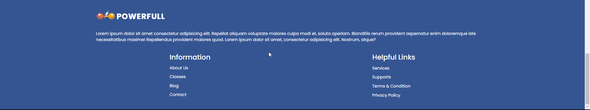
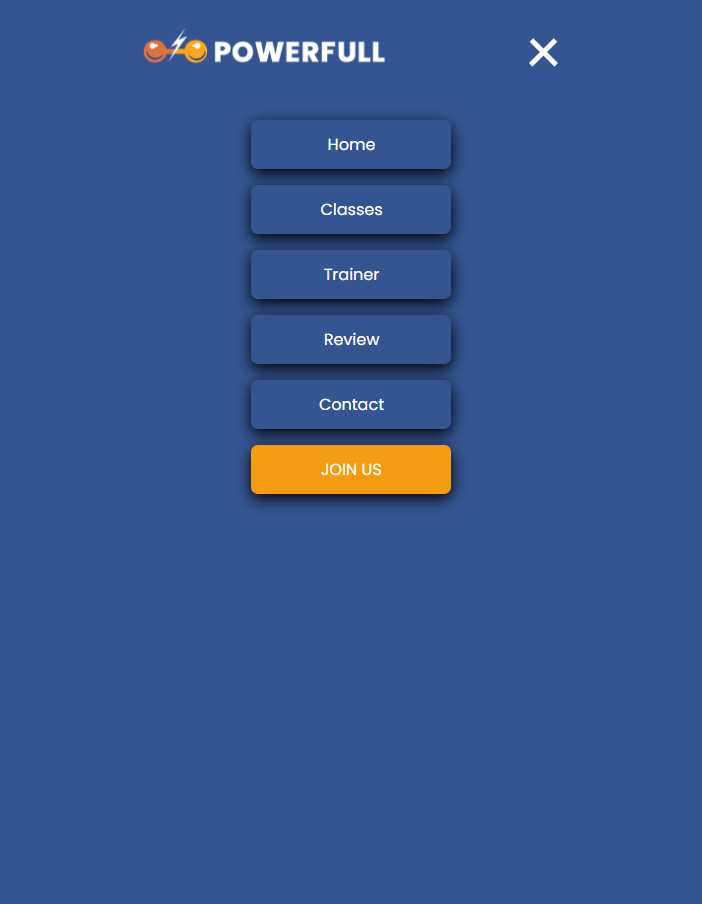

# Tamamen Duyarlı Fitness Center Landing Page

## Diğer Dillerde README :books:

- :tr: [Türkçe](README_TR.md)
- :uk: [English](README.md)

## Teknoloji Yığını

    

## Tanıtım

Tamamen duyarlı Fitness Center Landing Page'e hoş geldiniz! Bu landing page, fitness merkezimizin özelliklerini ve tekliflerini sergilemek amacıyla tasarlanmıştır. Fitness tutkunu olun veya fitness yolculuğunuza yeni başlıyor olun, merkezimizde herkes için bir şeyler bulunmaktadır.

### Proje Genel Bakış

1. Proje, CSS çerçeveleri veya kütüphaneleri olmadan saf CSS kullanılarak inşa edilmiştir. Bu, stillemenin tamamen özelleştirilmiş ve fitness merkezi landing page'inin özel ihtiyaçlarına uygun olmasını sağlar.
 
2. Landing page tamamen duyarlıdır, yani farklı ekran boyutlarına ve cihazlara uyacak şekilde düzen ve tasarımını adapte eder. Masaüstü, dizüstü bilgisayar, tablet veya mobil telefon üzerinde görüntülendiğinde, landing page optimal bir kullanıcı deneyimi sunacaktır.
 
3. Landing page aynı zamanda farklı web tarayıcılarıyla uyumludur, bu da Chrome, Firefox, Safari ve Edge gibi popüler tarayıcılarda doğru bir şekilde çalışmasını ve görüntülenmesini sağlar.
 
4. Duyarlı tasarım ve uyumluluk, ekran boyutu ve cihaza bağlı olarak farklı stillerin ve düzenlerin uygulanmasına izin veren CSS medya sorguları kullanılarak elde edilir.
 
    - **Media Sorguları**

    Fitness Center Landing Page'de şu medya sorguları kullanılarak duyarlılık ve uyumluluk sağlanır:

    - `@media all and (min-width: 1440px)`: Bu medya sorgusu, minimum 1440 piksel genişliğindeki ekranları hedefler.

    - `@media all and (min-width: 1044px) and (max-width: 1440px)`: Bu medya sorgusu, minimum 1044 piksel genişliğinde ve maksimum 1440 piksel genişliğindeki ekranları hedefler.

    - `@media all and (min-width: 768px) and (max-width: 1044px)`: Bu medya sorgusu, minimum 768 piksel genişliğinde ve maksimum 1044 piksel genişliğindeki ekranları hedefler.

    - `@media all and (min-width: 480px) and (max-width: 768px)`: Bu medya sorgusu, minimum 480 piksel genişliğinde ve maksimum 768 piksel genişliğindeki ekranları hedefler.

    - `@media all and (min-width: 360px) and (max-width: 480px)`: Bu medya sorgusu, minimum 360 piksel genişliğinde ve maksimum 480 piksel genişliğindeki ekranları hedefler.

    - `@media all and (max-width: 360px)`: Bu medya sorgusu, maksimum 360 piksel genişliğindeki ekranları hedefler.

    Bu medya sorguları, landing page'in içeriğini ekran boyutuna bağlı olarak ayarlayarak farklı cihazlar ve tarayıcılarda optimal bir kullanıcı deneyimi sunmasına olanak tanır.
 
5. Landing page'in düzeni ve içeriği, kullanıcılara sorunsuz ve sezgisel bir deneyim sunmak için özenle tasarlanmıştır. Navigasyon menüsü, bölümler ve çağrı yapma düğmeleri, kullanıcıları yönlendirmek ve fitness merkezinin tekliflerini keşfetmeye teşvik etmek amacıyla stratejik bir şekilde yerleştirilmiştir.
 
6. CSS animasyonları ve geçişlerin kullanımı, etkileşim ekler ve landing page'in görsel çekiciliğini arttırır. Bu, kullanıcıları çeker ve dinamik ve etkileşimli bir deneyim yaratır.
 
7. Landing page, optimize edilmiş CSS kodu ve resim sıkıştırma teknikleri ile performans için optimize edilmiştir. Bu, hızlı yükleme süreleri ve kullanıcılar için sorunsuz bir tarama deneyimi sağlar.
 
8. Kod, bakım ve ölçeklenebilirlik için en iyi uygulamalara uygun şekilde iyi bir yapıya ve düzene sahiptir. Bu, landing page'in kolay özelleştirme ve gelecekteki güncellemelere olanak tanır.

Genel olarak, fitness merkezi landing page'inin tamamen duyarlı ve uyumlu doğası, farklı cihaz veya tarayıcı seçimlerine bakılmaksızın geniş bir kullanıcı kitlesine ulaşmasını ve etkileşimde bulunmasını sağlar.

## Canlı Önizleme

## Proje Ekran Görüntüleri

*Ana Sayfa Bölümü*

*Sınıflar Bölümü*

*Eğitmen Bölümü*

*İnceleme Bölümü*

*İletişim Bölümü*

*Alt Bilgi Bölümü*

*Hamburger Menü*

## License

This project is licensed under the MIT License. Refer to the `LICENSE` file for more information.

## Contact

  <a href="https://github.com/Bpolat0">
    

  <a href="https://discord.com/users/m.batuhanpolat">
    

  
  

